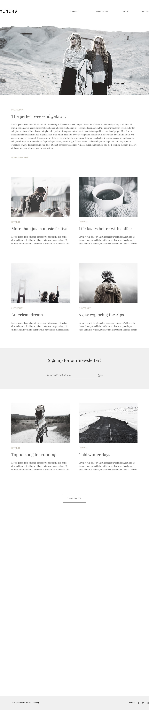

## Alexander Shatalov > HTML5-CSS3 > Lesson 6 > Адаптивная верстка по PSD 

### Используемые инструменты и технологии:
- HTML
- PUG
- BEM (БЭМ)
- Bootstrap
- CSS3 (+ normalize.css)
- SCSS
- jQuery
- jQuery.ScrollTo (http://flesler.blogspot.com)
- Gulp (+ модули)
- Спрайты изображений
- PictureFill (https://scottjehl.github.io/picturefill/)

### Адаптивность: (проверено с 1600x900 до 320x480 - Desktop First Method), разное оформление меню.

### Кроссбраузерность:
- ПК: Chrome 56, FireFox 51, IE 11, iOS Safari 9.1;
- Смартфон: Android 5 Chrome;
- В IE 8 макет на месте (float верстка), но не работают элементы на JQuery. Даже "srcset" и "picture" работают благодаря PictureFill.

### Валидация:
- HTML (без ошибок);
- CSS (предупреждения на "неизвестные" вендорные префиксы от "autoprefixer", также не знает "text-justify: newspaper и zoom: 1" - хак IE6-7 для justify элементов меню; аналогично для библиотеки BootStrap).

### Оптимизация (общий вес всей страницы около 400 Кб):
- BootStrap - только Grid и normalize;
- Конкатенация всех CSS в один файл, удаление комментариев, сжатие;
- Конкатенация некритичных к первоначальной загрузке JS в один файл, удаление комментариев, сжатие;
- HTML - сжатие;
- Google шрифты - только используемые начертания семейств;
- Общий спрайт для 5 иконок (отказался от Font Awesome);
- Оптимизация веса картинок, подгрузка через "picture" согласно разрешению экрана пользователя.

### Google PageSpeed Insights:
- Для мобильных - 85 / 100;
- Для компьютеров - 97 / 100;

### Попиксельная совместимость (PixelPerfect):
- В выбранном макете скачут элементы относительно сетки, не везде всё идеально выровнено, поэтому сделал только шапку.

### Микроформаты:
- Валидатор микроразметки Яндекс - без ошибок. 

